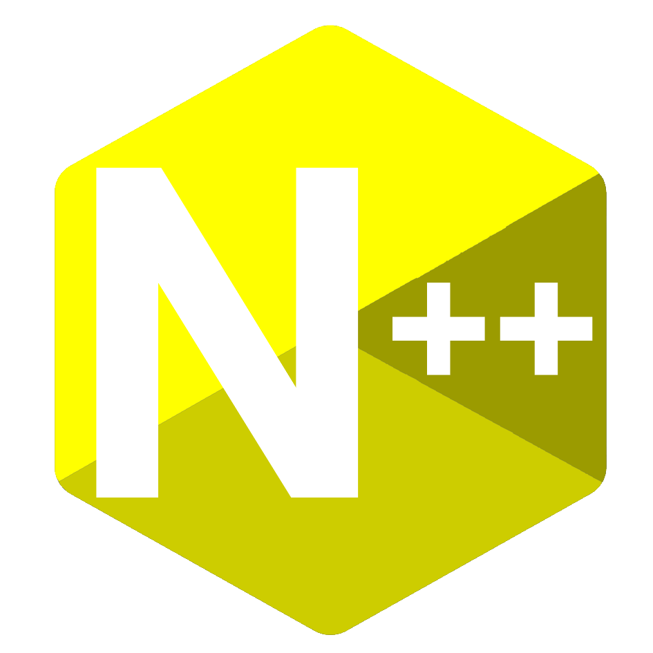

# N++ Compiler/VM

Credits to Liam Vickers for the design, and credits to [Crafting Interpreters](https://craftinginterpreters.com) for the original code.



## How to use (Command wise)

<exe> <file>.npp
nppc1 file.npp

## How to use (Code wise)

Variables:

```
int varName = 10;
```

Broadcasting:

```
broadcast "Hello, world!";
broadcast 10 + 2;
broadcast varName + 5;
```

Getting input:

```
getin "> ";
broadcast input;
```

While loops:

```
int i = 0;
while (i < 100) {
    i = i + 1;
}
```

For loops:

```
for (int i = 0; i < 10; i = i + 1) {
    broadcast "lol";
}
```

Functions:

```
def foo(x, y) {
    return x * y;
}

broadcast foo(2873, 284);
```

Classes:

```
class Person {
    sayName() {
        broadcast this.name;
    }
}

int jane = Person();
jane.name = "Jane";

int method = jane.sayName;
method();
```

Inhereted classes:

```
class A {
    method() {
        broadcast "A method";
    }
}

class B < A {
    method() {
        broadcast "B method";
    }

    test() {
        super.method();
    }
}

class C < B {}

C().test();
```

If statements:

```
int i = 0;

if (i == 0) {
    broadcast "A";
} else if (i == 1) {
    broadcast "B";
} else {
    broadcast "C";
}
```

Comments:

```
// This is a comment
```

Redefining variables:

```
int i = 0; // Original variable
broadcast i;
i = 1; // Changing the variable's value
broadcast i;
```

Others:

```
broadcast true; // [TRUE]
broadcast false; // [FALSE]
broadcast null; // [NULL]
```
